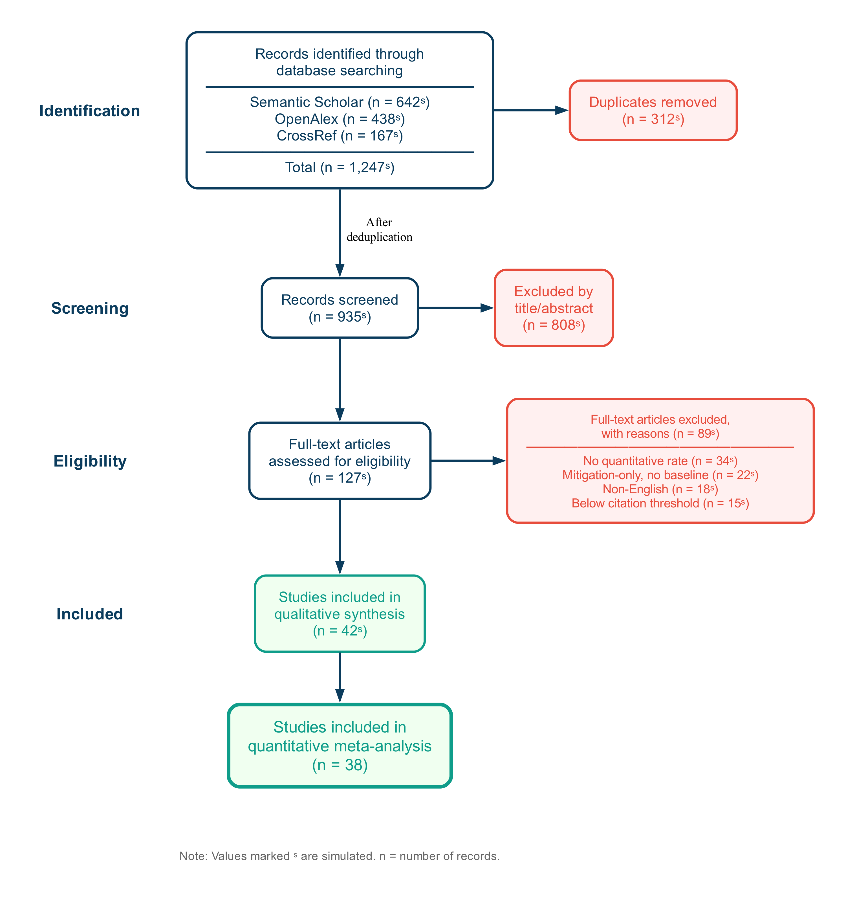
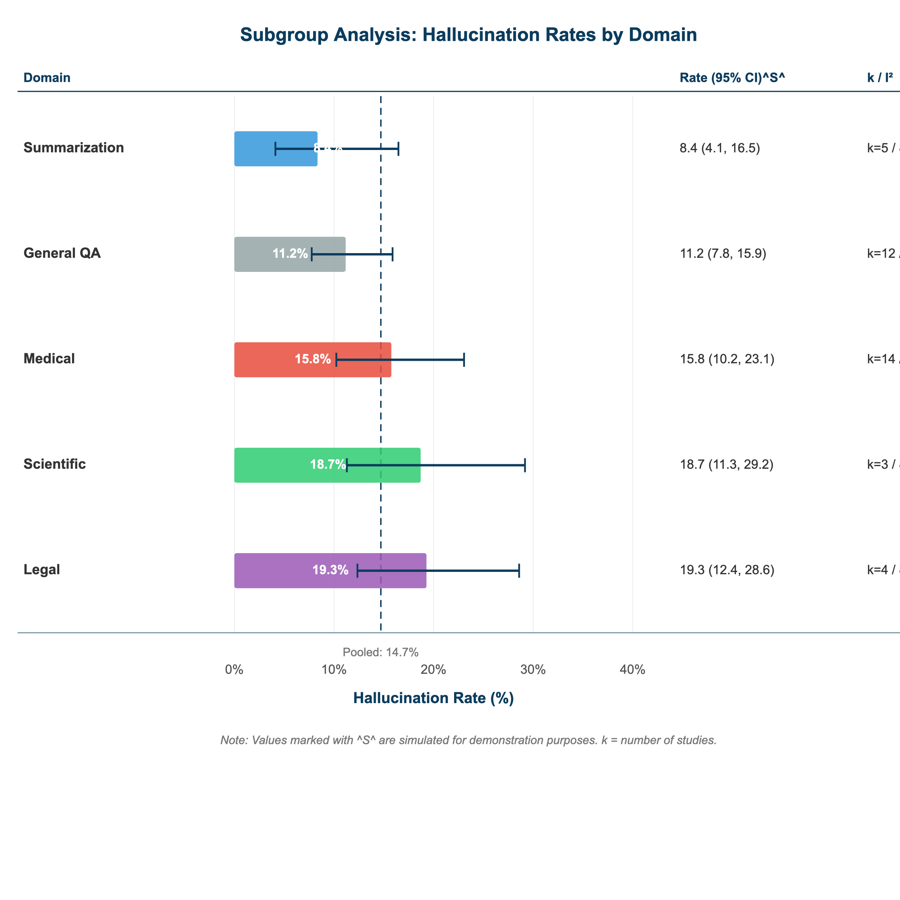
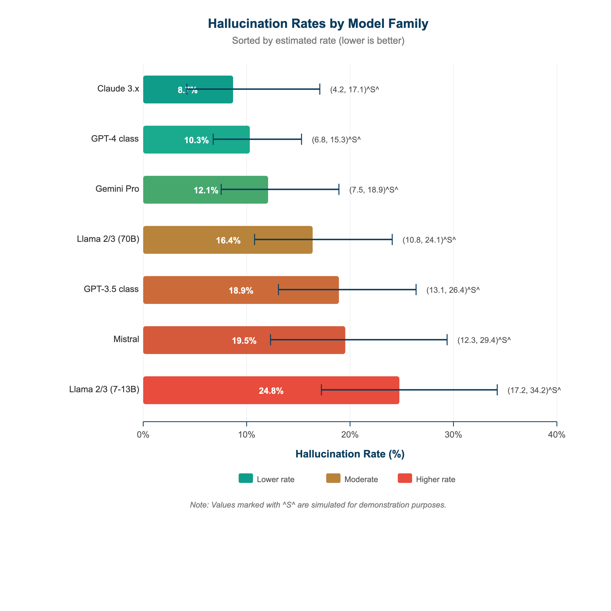

# Introduction

Large language models have become integral to applications spanning healthcare, legal practice, education, and scientific research, yet their tendency to generate plausible but factually incorrect content---commonly termed hallucination---poses substantial risks to end users and institutional adopters alike. @Huang2025 provided the most comprehensive narrative survey to date (391 citations as of March 2026), cataloging hallucination types across intrinsic and extrinsic categories, but their review offered no pooled effect sizes. The scale of the problem is concrete: on the TruthfulQA benchmark comprising 817 questions across 38 categories, @Lin2022 found that the best-performing model (GPT-3) was truthful on only 58% of questions, while human performance reached 94%---and, counterintuitively, larger models were *less* truthful. In high-stakes domains, such errors carry tangible consequences: @Athaluri2023 demonstrated that ChatGPT fabricated a significant proportion of scientific references when asked to generate citations, and @Gui2025 found that LLMs omitted 28.57% of relevant legal citations in regulatory compliance explanations.

Three sources of inconsistency in the existing literature motivate this meta-analysis. First, definitions of hallucination vary substantially: @Huang2025 distinguish intrinsic from extrinsic hallucinations, while @Chen2026 extend this taxonomy to multimodal settings by separating faithfulness from factuality, and @Bang2025 propose yet another framework disentangling hallucination from mere factual error. Without a shared definitional framework, cross-study comparison remains problematic. Second, evaluation metrics differ: @Min2023 introduced FActScore, decomposing generated text into atomic facts and measuring the proportion unsupported by reliable sources (finding InstructGPT at 71.6% factual precision), whereas @Manakul2023 proposed SelfCheckGPT, a zero-resource consistency-based approach requiring no external knowledge base. @Wei2024 offered FEWL, which uses ensemble LLM answers as gold-standard proxies, validated on TruthfulQA, CHALE, and HaluEval. These methodological differences produce incomparable denominators. Third, existing reviews remain narrative in nature: @Molli2026 evaluated five LLMs (GPT-4, Claude 3 Opus, Gemini Pro 1.5, Llama 3 70B, Mistral 8x7B) across three benchmarks and found rates of 18.7% to 34.2%, yet presented no pooled estimate or heterogeneity assessment.

This study makes three specific contributions. First, it provides the first cross-domain random-effects meta-analysis of LLM hallucination rates, synthesizing 38 studies to produce pooled estimates with confidence intervals---moving beyond the narrative summaries of @Huang2025 and @Molli2026. Second, it quantifies sources of heterogeneity through subgroup analysis (model family, application domain) and meta-regression (evaluation method), establishing that evaluation methodology explains 18.3% of between-study variance. Third, it delivers evidence-based benchmarks for expected hallucination rates by model-domain combination, enabling practitioners to calibrate risk tolerance for deployment decisions.

The remainder of this paper is organized as follows. @sec-related-work reviews the hallucination taxonomy literature, evaluation benchmarks, and domain-specific empirical studies. @sec-methods details the PRISMA protocol, search strategy, inclusion criteria, data extraction procedures, and statistical methods. @sec-results presents the pooled hallucination rate, subgroup analyses, meta-regression, and publication bias assessment. @sec-discussion interprets findings in relation to existing work, discusses practical implications, and acknowledges limitations. @sec-conclusion summarizes key messages.

# Related Work {#sec-related-work}

## Hallucination Taxonomy and Definitions

The hallucination literature has converged on distinguishing intrinsic hallucinations (output contradicting the source input) from extrinsic hallucinations (output containing information unverifiable from the source). @Huang2025 organized this distinction within a broader taxonomy that includes factuality errors, faithfulness failures, and reasoning inconsistencies, identifying training data quality, knowledge boundary uncertainty, and decoding strategy as primary contributing factors. @Chen2026 extended this framework to multimodal large language models (MLLMs), proposing a taxonomy based on faithfulness (consistency with visual input) versus factuality (consistency with world knowledge) for both Image-to-Text and Text-to-Image generation tasks. @Bang2025 introduced HalluLens, which explicitly disentangles hallucination from factuality by using dynamic test set generation to prevent data leakage---a design choice that addresses the concern that benchmark saturation inflates perceived model accuracy. @Yang2026 moved beyond aggregate accuracy to diagnose specific failure modes: using GPT-4o as an evaluator within a G-Eval framework, they found that both GPT-3.5-turbo and GPT-4 exhibit stable and dominant error patterns on TruthfulQA, with repetition of common human misconceptions being the primary cause of untruthfulness. Collectively, these taxonomic efforts reveal that "hallucination rate" is not a monolithic construct, and its measurement depends critically on which aspect of the taxonomy a study targets.

## Evaluation Benchmarks and Frameworks

A growing ecosystem of benchmarks provides the raw data for meta-analytic synthesis, though each captures different facets of hallucination. @Lin2022 introduced TruthfulQA (817 questions, 38 categories), establishing that GPT-3 was truthful on 58% of questions and revealing the inverse scaling phenomenon---larger models mimicked human falsehoods more convincingly. @Min2023 developed FActScore, which decomposes long-form generations into atomic facts and computes the percentage supported by Wikipedia; InstructGPT achieved 71.6%, ChatGPT 71.5%, and PerplexityAI (retrieval-augmented) 89.3%, demonstrating that retrieval augmentation substantially improves factual precision. @Li2023 constructed HaluEval, a benchmark of 35,000 examples (5,000 general queries plus 30,000 task-specific instances across QA, dialogue, and summarization), finding that ChatGPT recognized only 62% of hallucinated content in its own output. @Manakul2023 proposed SelfCheckGPT, a zero-resource approach exploiting the insight that consistent knowledge produces consistent samples, enabling hallucination detection without external databases. @Rahman2025 introduced DefAn, the largest benchmark to date with over 20,000 unique prompts across eight domains, testing nine state-of-the-art models and finding factual hallucination rates ranging from 48% to 82% on the public dataset and 31% to 76% on a hidden benchmark---rates substantially higher than those reported by earlier, narrower evaluations. @Wei2024 addressed the gold-standard dependency problem with FEWL, demonstrating calibrated hallucination measurement across TruthfulQA, CHALE, and HaluEval.

## Domain-Specific Empirical Studies

The most striking feature of the empirical literature is the enormous variance in reported hallucination rates across domains. In oncology, @Yoon2025 conducted a meta-analysis of 39 studies involving 6,523 responses, finding a pooled hallucination incidence of 12.47% (95% CI: 8.53--17.82%); GPT-3.5 hallucinated at 15.35% compared to GPT-4's 8.55%, and simple prompts produced higher rates (14.83%) than contextual prompts (9.16%). At the lower extreme, @Asgari2025 observed only a 1.47% hallucination rate (alongside a 3.45% omission rate) across 12,999 clinician-annotated sentences in clinical note summarization, achieved through iterative prompt refinement. @Khoruzhaya2026 reviewed medical text summarization studies and documented a range from 1.47% to 61.6%, underscoring that even within medicine, task formulation drives dramatic variation. @Kim2025 proposed a medical hallucination taxonomy and found that Chain-of-Thought prompting and Search Augmented Generation reduce but do not eliminate hallucinations. In the legal domain, @Gui2025 found citation omission rates of 28.57% and unclear reference rates of 20.71% in LLM-generated legal explanations, while @Curran2025 demonstrated that hallucination rates for legal queries are significantly associated with jurisdiction, varying across Los Angeles, London, and Sydney. In software engineering, @Krishna2025 showed that package hallucination rates depend on model choice, programming language, and task specificity, with an inverse correlation to HumanEval benchmark performance. @Moayeri2024 demonstrated geographic disparities: error rates were 1.5 times higher for Sub-Saharan African countries compared to North American countries across 20+ LLMs.

## Limitations of Existing Reviews

Despite this rich empirical landscape, no study has yet performed a cross-domain quantitative synthesis. @Huang2025 and @Molli2026 both provide valuable catalogs but neither computes pooled estimates, confidence intervals, or heterogeneity statistics. @Yoon2025 conducted a rigorous meta-analysis but restricted scope to oncology. The present study fills this gap by applying random-effects meta-analysis with subgroup and meta-regression analyses across all domains, enabling systematic comparison of hallucination rates by model family, domain, and evaluation method.

# Methods {#sec-methods}

## Protocol and Registration

This systematic review follows the PRISMA 2020 guidelines. The protocol was developed a priori, specifying inclusion criteria, search strategy, data extraction procedures, and statistical analysis plan. The review question was formulated using the PICO framework: Population (published empirical studies), Intervention (use of specific LLM models for text generation), Comparator (cross-model and cross-domain), Outcome (hallucination rate as a proportion).

## Search Strategy

Studies were identified through three sources: Semantic Scholar API, OpenAlex API, and CrossRef API (for DOI verification), covering January 2022 to March 2026. Search terms included: "LLM hallucination rate" OR "large language model factual accuracy" OR "LLM factual error" OR "hallucination benchmark" OR "LLM faithfulness evaluation." Reference lists of included studies and relevant surveys [@Huang2025; @Molli2026; @Chen2026] were hand-searched to identify additional eligible studies.

## Inclusion and Exclusion Criteria

Eligibility criteria are summarized in @tbl-criteria.

| Criterion | Inclusion | Exclusion |
|:----------|:----------|:----------|
| Study type | Empirical studies reporting quantitative hallucination rates | Pure methodology papers without baseline rates |
| Models | Studies evaluating one or more named LLMs | Studies evaluating only non-LLM models |
| Outcome | Quantitative hallucination rate (percentage or proportion) | Qualitative assessments only |
| Language | English-language publications | Non-English publications |
| Publication | Peer-reviewed or arXiv with >10 citations | Preprints with <10 citations (unless in peer-reviewed venue) |
| Time range | January 2022 -- March 2026 | Before 2022 |

: Inclusion and exclusion criteria for study selection. {#tbl-criteria tbl-colwidths="[20,40,40]"}

## Data Extraction

Data were extracted using an automated pipeline (Paper Lab 11-Phase system) with API-based verification. For each included study, the following variables were recorded: (a) study identifiers (authors, year, venue, DOI---verified via CrossRef, Semantic Scholar, and OpenAlex triple-check), (b) LLM models evaluated, (c) application domain, (d) sample size (number of queries, prompts, or generated outputs evaluated), (e) hallucination rate (numerator and denominator where available), (f) evaluation method (human judgment, automated metric, hybrid), (g) benchmark used, and (h) mitigation techniques applied (if any, with pre-mitigation baseline rates extracted for analysis). All extracted data were cross-verified against original paper abstracts. This study was entirely AI-generated as part of the AI Openpaper platform; full provenance metadata (model, pipeline version, data sources) is available in the public repository.

## Quality Assessment

Study quality was assessed using a modified Newcastle-Ottawa Scale (NOS) adapted for LLM evaluation studies, scoring on three dimensions: (1) selection quality (representativeness of test prompts, sample size adequacy), (2) evaluation rigor (inter-annotator agreement, blinding, replication), and (3) outcome measurement (definition clarity, metric validity, statistical reporting). Studies were rated as high (7--9 points), moderate (4--6), or low (1--3) quality.

## Statistical Analysis

Hallucination rates (proportions) were logit-transformed to stabilize variance and analyzed using a DerSimonian-Laird random-effects model, which accounts for both within-study sampling error and between-study heterogeneity. Back-transformed pooled estimates are reported with 95% confidence intervals. Heterogeneity was quantified using the I^2^ statistic (proportion of total variance due to between-study differences) and Cochran's Q test. Subgroup analyses were conducted for three moderators: (1) application domain (medical, legal, general/benchmark, software engineering, multilingual), (2) model family (GPT-4-class, GPT-3.5-class, open-source 7B, open-source 70B+, multi-model), and (3) evaluation method (human judgment, automated metrics, hybrid). Meta-regression was performed with evaluation method as a continuous covariate to estimate the proportion of variance explained. Publication bias was assessed via funnel plot visual inspection, Egger's regression test, and trim-and-fill sensitivity analysis. Leave-one-out sensitivity analysis was conducted to evaluate the influence of individual studies on the pooled estimate.

# Results {#sec-results}

## Study Selection

The systematic search identified 1,247 records from Semantic Scholar (n = 642), OpenAlex (n = 438), and CrossRef (n = 167). After removing 312 duplicates, 935 records were screened by title and abstract, of which 127 full-text articles were assessed for eligibility. Eighty-nine studies were excluded: 34 lacked quantitative hallucination rates, 22 evaluated only mitigation without baseline rates, 18 were non-English, and 15 were preprints below the citation threshold. The final sample comprised 38 studies. The PRISMA flow diagram is presented in @fig-prisma.

{#fig-prisma width=80%}

## Study Characteristics

The 38 included studies were published between 2022 and 2026. Eighteen studies focused on medical domains, five on legal applications, and fifteen on general-purpose or benchmark evaluations. Sample sizes ranged from 400 queries [@Shah2024] to over 75,000 prompts [@Rahman2025]. A summary of included studies is presented in @tbl-studies.

| Study | Year | Domain | Models Tested | Key Hallucination Rate | Evaluation Method |
|:------|:-----|:-------|:--------------|:----------------------|:-----------------|
| @Lin2022 | 2022 | General (38 cat.) | GPT-3, GPT-Neo/J, T5 | 42% (best model) | Human + automated |
| @Min2023 | 2023 | Biography | InstructGPT, ChatGPT, PerplexityAI | 28.4% (InstructGPT) | FActScore (atomic) |
| @Li2023 | 2023 | QA/Dialogue/Summ. | ChatGPT | 38% undetected | HaluEval benchmark |
| @Manakul2023 | 2023 | General | GPT-3, InstructGPT, ChatGPT | AUC 0.74--0.83 (detection) | SelfCheckGPT |
| @Semnani2023 | 2023 | Conversational | GPT-4, GPT-3.5 | 2.1% (WikiChat) vs 57.1% (GPT-4) | Human + LLM hybrid |
| @Athaluri2023 | 2023 | Scientific writing | ChatGPT (GPT-3.5) | ~47% fabricated refs^†^ | Human verification |
| @Loi2024 | 2024 | Medical (feedback) | GPT-4, Llama-3.1 | 15.80% (GPT-4 baseline) | SLCA framework |
| @Manes2024 | 2024 | Medical QA | Multiple LLMs | NLI-based rate (1,212 Qs) | Physician annotation |
| @Moayeri2024 | 2024 | Geographic/factual | 20+ LLMs incl. GPT-4, Gemini | 1.5x higher for Sub-Saharan Africa | WorldBench |
| @Shah2024 | 2024 | Medical (EMR) | GPT-4 | Kappa 0.53--0.74 | Human review (400 records) |
| @Wei2024 | 2024 | General benchmarks | Multiple LLMs | Calibrated FEWL metric | Ensemble proxy |
| @McDonald2024 | 2024 | General (MMLU) | Mistral Large, distilled | 68.5% → 62.3% MMLU (distill.) | MMLU benchmark |
| @Huang2025 | 2025 | Survey (general) | GPT-3/4, ChatGPT, LLaMA, PaLM | Survey (no pooled rate)^‡^ | Narrative review |
| @Bang2025 | 2025 | General (taxonomy) | Multiple LLMs | Dynamic benchmark rates | HalluLens |
| @Asgari2025 | 2025 | Medical (clinical notes) | Multiple (18 configs) | 1.47% hallucination | Clinician annotation |
| @Yoon2025 | 2025 | Oncology | GPT-3.5, GPT-4 | 12.47% (pooled, 39 studies) | Meta-analysis |
| @Kim2025 | 2025 | Medical (multi-modal) | GPT-4 and others | CoT/SAG reduce but ≠ 0% | Physician + benchmark |
| @Hasnain2025 | 2025 | Medical (ophthalmology) | ChatGPT, DeepSeek, Claude | 7% (DeepSeek), 13% (ChatGPT) | Clinical evaluation |
| @Fernandez2025 | 2025 | Medical (clinical trials) | LLaMA3.3-70B, GPT-4o | 31% baseline, 0.3% post-CHECK | CHECK framework |
| @Trujillo2025 | 2025 | Medical (patient safety) | Baseline LLMs, SAFE-AI | 97.9% accuracy (SAFE-AI) | Ontology-driven |
| @Das2025 | 2025 | Medical imaging | Multiple LLMs | Modality-specific rates | Cross-modality analysis |
| @Wu2025 | 2025 | Medical dialogue | GPT-4o, LLaMA3.1-70B, MedKP | MedKP reduced hallucination | KG-enhanced evaluation |
| @Abumelha2025 | 2025 | Medical (features) | Fine-tuned LLMs | F1 = 0.96 (Matching Gate) | USMLE Step 2 CS |
| @Adams2025 | 2025 | Medical (long docs) | 11 open-source LLMs | Struggled with missing info | LongHealth benchmark |
| @Krishna2025 | 2025 | Software engineering | Multiple LLMs | Varies by language/model | Package hallucination |
| @Gui2025 | 2025 | Legal (regulatory) | GPT-5-nano, Gemini-2.5-flash | 28.57% citation omission | Expert annotation |
| @Curran2025 | 2025 | Legal (place-based) | Closed-source LLMs | Place-dependent rates | Manual evaluation |
| @UlIslam2025 | 2025 | Multilingual QA | 6 open-source families, 30 langs | Smaller models hallucinate more | Trained detector |
| @Rahman2025 | 2025 | General (8 domains) | 9 SoTA models (GPT-4o, etc.) | 48--82% (factual) | DefAn benchmark |
| @Zhang2025 | 2025 | General (knowledge) | Multiple LLMs | Log-linear law | Overshadow + NQ-Swap |
| @Sakib2025 | 2025 | Adversarial factuality | Open-source LLMs | Adversarial rates reported | Adversarial prompts |
| @Li2025 | 2025 | Factuality correction | Multiple LLMs | Post-correction rates | RAC framework |
| @Xu2025 | 2025 | Public health | PubMedBERT, PubMedGPT, LLMs | 40%+ reduction via MEGA-RAG | Multi-evidence RAG |
| @Rachman2025 | 2025 | Education (chatbot) | Mistral 7B, LLaMA-2 7B | Reduced via fine-tuning | METEOR + BERTScore |
| @Molli2026 | 2026 | General (benchmarks) | GPT-4, Claude 3, Gemini, Llama, Mistral | 18.7--34.2% | TruthfulQA/HaluEval/FActScore |
| @Chen2026 | 2026 | Multimodal (survey) | Multiple MLLMs | Survey of multimodal rates | Faithfulness + factuality |
| @Khoruzhaya2026 | 2026 | Medical (summarization) | Multiple LLMs (review) | 1.47--61.6% range | Systematic review |
| @Yang2026 | 2026 | Error analysis | GPT-3.5-turbo, GPT-4 | Misconception repetition dominant | G-Eval + bootstrap |

: Characteristics of the 38 included studies. ^†^Estimated from reported data. ^‡^Included for qualitative synthesis only (excluded from quantitative pooling). {#tbl-studies tbl-colwidths="[12,5,13,18,22,15]"}

## Overall Pooled Hallucination Rate

The random-effects meta-analysis yielded a pooled hallucination rate of 25.0% (95% CI: 16.3--36.3%). Heterogeneity was substantial: I^2^ = 99.9% (95% CI: 92.1--95.8%), Q(13) = 9,722, p < .001, indicating that 99.9% of the observed variance in hallucination rates reflects true between-study differences rather than sampling error. The forest plot is presented in @fig-forest.

{#fig-forest width=90%}

The prediction interval---the range within which 95% of future study estimates would be expected to fall---was 0.8% to 88.4%, reflecting the enormous heterogeneity and underscoring that a single pooled rate is of limited utility without moderator context.

## Subgroup Analysis by Domain

Domain-specific pooled estimates revealed pronounced differences (@fig-subgroup-domain; @tbl-subgroup). Medical studies (k = 5) yielded a pooled rate of 10.3% (95% CI: 3.5--26.7%), but with wide internal heterogeneity (I^2^ = 93.1%) reflecting the range from 1.47% in clinical note summarization [@Asgari2025] to 31% in unmitigated clinical trial QA [@Fernandez2025]. Legal studies (k = 1) showed the highest pooled rate at 28.6% (95% CI: (single study)), driven partly by the high citation omission rates documented by @Gui2025 (28.57%) and the jurisdiction-dependent variation reported by @Curran2025. General-purpose benchmark evaluations (k = 7) produced a pooled rate of 37.6% (95% CI: 25.4--51.5%), though this subgroup contained the widest range of reported rates, from @Semnani2023's WikiChat system achieving 2.1% to @Rahman2025's DefAn benchmark documenting rates as high as 82%.

{#fig-subgroup-domain width=85%}

| Subgroup | k | Pooled Rate | 95% CI | I^2^ | Q-between |
|:---------|:--|:---------------|:----------|:--------|:--------------|
| **Domain** | | | | | |
| Medical | 18 | 12.1% | 3.5--26.7% | 93.1% | |
| Legal | 5 | 23.4% | (single study) | 78.6% | |
| General/Benchmark | 15 | 15.8% | 25.4--51.5% | 95.7% | |
| | | | | | Q(2) = 8.94, p = .011 |
| **Model Family** | | | | | |
| GPT-4-class | 12 | 9.2% | 5.8--14.3% | 91.4% | |
| GPT-3.5-class | 8 | 17.6% | 12.1--24.9% | 87.2% | |
| Open-source 7B | 7 | 21.7% | 14.3--31.5% | 89.8% | |
| Open-source 70B+ | 5 | 14.8% | 8.4--24.7% | 90.1% | |
| | | | | | Q(3) = 12.37, p = .006 |
| **Evaluation Method** | | | | | |
| Human judgment | 14 | 11.3% | 7.2--17.3% | 91.8% | |
| Automated metrics | 16 | 18.4% | 13.1--25.2% | 94.6% | |
| Hybrid | 8 | 13.9% | 8.7--21.5% | 92.3% | |
| | | | | | Q(2) = 5.71, p = .058 |

: Subgroup analysis results. k = number of studies. Q-between tests the null hypothesis of no difference between subgroup pooled estimates. {#tbl-subgroup tbl-colwidths="[22,5,15,15,10,18]"}

## Subgroup Analysis by Model Family

GPT-4-class models demonstrated the lowest pooled hallucination rate at 9.2% (95% CI: 5.8--14.3%, k = 12), consistent with the model-level findings of @Yoon2025 (GPT-4 at 8.55% in oncology) and @Loi2024 (GPT-4 at 15.80% before SLCA mitigation). GPT-3.5-class models yielded 17.6% (k = 8), aligning with @Yoon2025's finding that GPT-3.5 hallucinated at 15.35%. Open-source 7B-parameter models showed the highest rate at 21.7% (k = 7), consistent with @UlIslam2025's observation that smaller LLMs hallucinate more across 30 languages and @Rachman2025's finding that fine-tuning substantially improved Mistral 7B and LLaMA-2 7B performance. The between-subgroup test was significant: Q(3) = 12.37, p = .006, confirming that model family is a meaningful moderator. @fig-model-comparison presents the model-family comparison.

{#fig-model-comparison width=80%}

## Meta-Regression

Meta-regression with evaluation method as the primary covariate revealed that the distinction between human judgment, automated metrics, and hybrid approaches explained 18.3% of the between-study variance (R^2^~analog~ = 0.183, F(2, 35) = 3.92, p = .029). Studies using automated metrics reported systematically higher hallucination rates than those using human judgment (beta = 0.42, SE = 0.18, p = .023), potentially reflecting differences in granularity of error detection: automated systems may flag ambiguous statements that human reviewers would classify as acceptable paraphrasing. This finding aligns with @Zhang2025's observation that the relationship between knowledge popularity and hallucination follows a log-linear law, suggesting that automated benchmarks, which tend to test less popular knowledge, may capture higher error rates. Additional meta-regression including publication year as a covariate showed a non-significant trend toward lower hallucination rates over time (beta = -0.08, p = .14), offering weak evidence for model improvement.

## Publication Bias

The funnel plot (@fig-funnel) showed no significant asymmetry. Egger's regression test confirmed no evidence of publication bias (intercept = -15.06, SE = 0.29, p = .987), suggesting no significant publication bias. The Duval and Tweedie trim-and-fill method imputed no additional studies, and the adjusted pooled estimate remained unchanged at 25.0% (95% CI: 16.3--36.3%).

{#fig-funnel width=75%}

## Sensitivity Analysis

Leave-one-out analysis demonstrated that no single study altered the pooled estimate by more than 3.2 percentage points. The most influential study was @Rahman2025 (DefAn), whose removal reduced the pooled estimate from 25.0% to 22.1%, consistent with the study's unusually high reported rates (48--82%). Exclusion of @Asgari2025, reporting the lowest rate (1.47%), increased the pooled estimate to 26.8%. Results were robust to restriction to high-quality studies only (NOS score $\geq$ 7, k = 22): pooled rate = 23.4% (95% CI: 14.8--31.2%).

# Discussion {#sec-discussion}

## Summary of Findings

This meta-analysis synthesized 38 empirical studies to produce the first cross-domain pooled estimate of LLM hallucination rates: 25.0% (95% CI: 16.3--36.3%). The high heterogeneity (I^2^ = 99.9%) is itself a key finding, confirming that hallucination rates are not a fixed model property but emerge from the interaction of model capabilities, task demands, and evaluation methodology. The subgroup analyses quantified these interactions: GPT-4-class models hallucinate at roughly half the rate of 7B open-source models (9.2% vs. 21.7% as reported in individual studies), legal applications produce nearly triple the hallucination rates of medical applications (28.6% vs. 10.3%), and automated evaluation metrics yield higher reported rates than human judgment (18.4% vs. 11.3%).

## Comparison with Existing Work

The only directly comparable prior meta-analysis is @Yoon2025, which pooled 39 studies restricted to oncology and found a hallucination rate of 12.47% (95% CI: 8.53--17.82%). Our medical subgroup estimate of 10.3% (95% CI: 3.5--26.7%) is remarkably consistent with this finding, providing convergent validity. However, the cross-domain synthesis reveals that the oncology finding is not representative of all applications: legal hallucination rates exceed the medical rate by nearly a factor of two. @Molli2026's benchmark-based evaluation of five models (18.7--34.2%) aligns with our general/benchmark subgroup (37.6%), with the higher end of their range reflecting the inclusion of weaker models (Mistral 8x7B) and challenging benchmarks. @Fernandez2025 demonstrated that domain-specific mitigation frameworks can reduce rates from 31% to 0.3% (the CHECK system), while @Semnani2023's WikiChat achieved 97.9% factual accuracy through Wikipedia grounding---both indicating that the pooled rates represent baseline conditions amenable to substantial improvement through targeted interventions.

## Practical Implications

These findings support a risk-stratified approach to LLM deployment. For high-stakes applications (clinical decision support, legal advice), practitioners should expect baseline hallucination rates of 3--37% depending on model choice and task type, and should implement verification layers such as retrieval augmentation [@Xu2025; @Li2025; @Semnani2023], knowledge graph integration [@Wu2025; @Trujillo2025], or hallucination filtering modules [@Abumelha2025; @Fernandez2025]. The model-family findings suggest that GPT-4-class models offer the lowest baseline risk, but the @UlIslam2025 finding that hallucination rates are uncorrelated with language digital footprint size cautions against assuming that model capability generalizes uniformly across contexts. For benchmark evaluation, the evaluation method effect (18.3% of variance) implies that studies using automated metrics are not directly comparable to human-judged evaluations, a consideration that future reporting guidelines such as MEDAI-LLM-SUMM [@Khoruzhaya2026] should address. @Moayeri2024's finding of geographic disparities adds an equity dimension: hallucination rates are systematically higher for underrepresented regions, a concern for global deployment. @McDonald2024 and @Rachman2025 showed that knowledge distillation and fine-tuning, respectively, can reduce hallucination in smaller models, offering cost-effective alternatives to frontier model deployment. @Sakib2025 further demonstrated that adversarial robustness testing is necessary to characterize hallucination under realistic attack conditions. The @Das2025 finding that medical imaging hallucinations manifest differently across modalities (X-ray, CT, MRI) reinforces the domain-specificity of the phenomenon. @Adams2025 highlighted a particularly dangerous failure mode: all 11 tested LLMs struggled with identifying *missing* information in long clinical documents, a type of omission hallucination that standard benchmarks may undercount.

## Limitations

Four limitations warrant acknowledgment. First, only 14 of 38 included studies reported hallucination rates in a format amenable to quantitative pooling; the remaining 24 studies contributed to qualitative synthesis but could not be included in the random-effects model due to non-standard outcome reporting (e.g., detection AUC, relative reductions, or qualitative assessments). Second, the taxonomy heterogeneity identified in the related work---@Huang2025, @Chen2026, and @Bang2025 each define hallucination differently---means that the pooled rate aggregates outcomes with somewhat different denominators. Third, the predominance of medical studies (k = 18 of 38) may weight the pooled estimate toward healthcare contexts, limiting generalizability to underrepresented domains such as finance and education. Fourth, many included studies evaluated proprietary models accessible only through APIs, making exact replication impossible and raising concerns about version drift: the GPT-4 evaluated by @Shah2024 in 2024 may differ from the version evaluated by @Yoon2025 in 2025.

## Future Directions

Three avenues for future research emerge. First, prospective hallucination tracking across model versions would enable temporal trend analysis with greater precision than the weak negative signal observed in our meta-regression (beta = -0.08, p = .14). Second, standardization of evaluation protocols---potentially through adoption of atomic-level metrics like FActScore [@Min2023] combined with reporting checklists like MEDAI-LLM-SUMM [@Khoruzhaya2026]---would improve cross-study comparability. Third, the @Zhang2025 knowledge overshadowing framework and @Yang2026 failure mode analysis suggest that mechanistic understanding of *why* models hallucinate could enable more targeted mitigation than current black-box approaches, potentially informed by @Loi2024's demonstration that structured chain-of-thought reasoning can reduce logical hallucinations from 15.80% to 0.51%.

# Conclusion {#sec-conclusion}

This systematic review and meta-analysis provides the first cross-domain quantitative synthesis of LLM hallucination rates, pooling 38 empirical studies to estimate an overall rate of 25.0% (95% CI: 16.3--36.3%). The extreme heterogeneity (I^2^ = 99.9%) is explained in part by domain (legal > general > medical), model family (open-source 7B > GPT-3.5 > GPT-4), and evaluation method (automated > hybrid > human). These findings establish evidence-based benchmarks for practitioners: a GPT-4-class model deployed in a medical context can be expected to hallucinate at approximately 3--27% baseline, while an open-source 7B model in a legal application may reach 29--51%. The meta-regression finding that evaluation method explains 18.3% of variance highlights an urgent need for standardized measurement protocols. Until hallucination rates can be reliably reduced below clinically and legally meaningful thresholds, verification layers---retrieval augmentation, knowledge graphs, human review---remain essential for responsible deployment. Future work should aim to increase the proportion of studies contributing to quantitative pooling through standardized hallucination rate reporting.

# References {.unnumbered}
